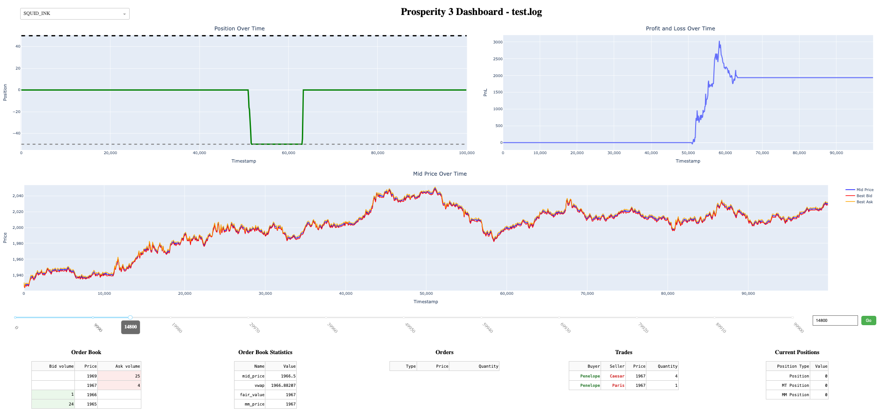

# Wolves of Muurstraat

## Table of Contents
- [Prosperity 3](#prosperity-3)
- [Organization](#organization)
  - [Dashboard](#dashboard)
- [Algorithmic Trading](#algorithmic-trading)
  - [Round 1](#round-1)
    - [Rainforest Resin](#rainforest-resin)
    - [Kelp](#kelp)
    - [Squid Ink](#squid-ink)
    - [Round 1 Results](#round-1-results)
- [Manual Trading](#manual-trading)
  - [Round 1](#manual-round-1)
  - [Round 2](#manual-round-2)
  - [Round 3](#manual-round-3)

## Prosperity 3
IMC Prosperity 3 was a global algorithmic trading competition that brought together over 12,000 teams from around the world. The competition ran over five rounds and fifteen days, simulating a dynamic multi-product marketplace where teams designed and submitted trading algorithms to maximize profit and loss (PnL).

Each round introduced new products, each with its own behavior and market structure. Some assets encouraged market making with predictable price movements and steady spreads, while others required aggressive market taking to capture short-term opportunities. A few products were specifically designed to enable pairs trading, cross-product arbitrage, or ETF-style decomposition, rewarding strategies that could identify and exploit statistical relationships across assets.

In addition to algorithmic trading, each round featured a small-scale manual trading challenge, typically focused on game theory, optimization, or decision-making based on limited information. While these contributed less to overall PnL, they added a fun and intellectually engaging element to the competition.

For full details on the product mechanics, simulation environment, and round structure, see the [Prosperity 3 Wiki](https://imc-prosperity.notion.site/Prosperity-3-Wiki-19ee8453a09380529731c4e6fb697ea4)

## Organization
We include all of work including a trading dashboard developed for visualizing positions, PnL, and market activity; a comprehensive set of research notebooks and analysis tools in the development folder that document our strategy development, data exploration, and backtesting results; and the core trading algorithms in the src directory, which implement our trading, market tracking and risk management logic across multiple products.

Instead of relying heavily on open-source tools, which many successful teams did, we chose to build our own infrastructure from scratch. This allowed us to tailor everything to our specific workflow and needs and helped us learn a lot in the process. We developed an internal order book, which allowed us to not only follow closely the market's dynamics and how our orders affected it, but also readily compute quantities such as mid prices, volume-adjusted mid prices, imbalances, and other quantities of interest, used in our trading strategies.   

### Dashboard
The dashboard was one of the first things we built, which allowed us to visualize and analyze the performance of our trading algorithms. It provides dynamic charts and tables for tracking positions, profit and loss (PnL), and order book data across all traded products. Users can select specific products, navigate through different timesteps, and view detailed metrics such as executed trades, order flow, and position limits. It was mainly used to quickly identify trends, monitor risk, and evaluate the effectiveness of your trading strategies during backtesting sessions.

## Algorithmic Trading
### Round 1 
In round 1, we had access to three products to trade: Rainforest Resin, Kelp and Squid Ink.

#### Rainforest Resin
Trading Resin was fairly simple, as the fair price hovered steadily around 10000. As such, we wrote our algorithm to trade against bids above 10,000 and asks below 10,000 + a tunable edge parameter to prioritize trades with higher potential profits. Additionally, we implemented a liquidation logic, which only acts when the potential profit is big enough; otherwise, it just waits for a better opportunity. This way, it avoids rushing and tries to make the most out of each trade. Besides taking orders, our algorithm would also market-make, placing bids and asks below and above 10000, respectively, with a certain edge over the other market-makers. One thing we noticed is that if there were already other orders close to the fair value and their volume is small (which we set up again as a tunable parameter), we would "join" those orders by matching their price, rather than trying to outbid or undercut them. The reason behind that was that other bots would usually place big orders, which would clear the already existing small volumes, but also fill our orders almost entirely as well. 

Using this strategy, we reached a final profit of around 40000 seashells.

#### Kelp 
Kelp was quite similar to Rainforest Resin in nature, with the key distinction being that its price could fluctuate slightly between timesteps. Unlike Rainforest Resin, which had a fixed true price, Kelp's true price evolved over time following a random walk. Therefore, the trading strategy here was centered on accurately estimating the fair value and using that estimate, guide both market making and market taking. Initially, we tried using the regular mid-price as a fair value, but found it to be too noisy. This was because many market participants were placing orders past the mid price, creating artificial noise and making the mid price less reliable — ironically, these were often the very orders the strategy wanted to trade against.

A breakthrough came from closely analyzing the order book: it became clear that a market-making bot was consistently quoting large sizes on both sides of the book, and its prices were stable and unaffected by smaller, noisier participants. By using the "market maker's mid" (the midpoint between the market maker's quotes) as the fair value, we found a much more stable and accurate reference price. This adjustment led to significantly better performance in backtests, with less noise and more consistent profits. Further validation came when testing on the competition website. We discovered that the website itself was marking profit and loss (PnL) to the market maker's mid, not the regular mid price. This was confirmed by running a simple buy-and-hold strategy in both our backtester (using the market maker mid) and on the website, and seeing the PnL graphs match exactly. This gave strong confidence that the market maker's mid was the true internal fair price of the game.

With this insight, we implemented a Kalman filter to smooth the market maker's mid and generate a dynamic fair value that discarded the short-term noise in the price movement. The remaining strategy mirrored Rainforest Resin's by market-making and market-taking with an additional limit on order volumes to limit adverse selection. We also found that Kelp's price was slightly mean-reverting, so we tuned the strategy to take advantage of this tendency. All parameters are optimized using grid search in the internal backtester, making the approach both robust and data-driven. 

This resulted in a final PnL of about 8000 seashells, which was due to the tighter spreads compared to the Rainforest Resin.

#### Squid Ink 
The strategy for Squid Ink deviated substantially from the previous two due to the much tighter spread, which prevented profitable market-making, and occasional market shocks, which meant that holding short or long volumes for longer amounts of time included a substantial risk. 

Therefore, the strategy for Squid Ink was built around detecting and riding short-term price trends, while also protecting from sudden, sharp price moves. At its core, the algorithm uses moving averages to spot when the price is trending up or down. It keeps track of both short-term and long-term averages, as well as the standard deviation of recent prices, to calculate a "z-score" that measures how strong the current trend is. When the short-term average moves significantly above the long-term average (with a high z-score), the algorithm sees this as a signal to go long (buy). If the short-term average drops well below the long-term average, it signals a short (sell) opportunity. The size of each trade and the threshold for acting are carefully tuned, so the algorithm only trades when the trend is strong enough to be meaningful.

A key feature of the Squid Ink strategy was its risk management. The algorithm constantly monitors for sudden, unusual price changes or big moves that could signal a reversal or a market shock. If it detects a sharp drop while holding a long position, or a sharp spike while short, it enters a "recovery mode" and temporarily stops trading in that direction, giving the market time to settle down before re-entering. The strategy also includes logic to close out positions when the trend weakens (the z-score drops below a certain threshold), ensuring it doesn't hold onto trades when the market is no longer moving in its favor. 

Using this strategy, we netted a profit of about 5000 seashells.

#### Round 1 Results
Using these strategies, we found ourselves with a total profit of about 53000 seashells, placing us at #13 out of the +12000 teams competing. 

## Manual Trading
### Round 1
The first round was a simple deterministic problem where the point was to maximize profits given a certain number of trades between products with a predetermined currency exchange rate. You had to pick the right "path" of trades leveraging the best exchange rates across a matrix of rates. Here we simply calculated the profit of every possible "trade path" and chose the best.

| From \ To       | Snowballs | Pizza | Silicon Nuggets | SeaShells |
|-----------------|----------|-------|-----------------|-----------|
| **Snowballs**   | 1.00     | 1.45  | 0.52            | 0.72      |
| **Pizza**       | 0.70     | 1.00  | 0.31            | 0.48      |
| **Silicon Nuggets** | 1.95  | 3.10  | 1.00            | 1.49      |
| **SeaShells**   | 1.34     | 1.98  | 0.64            | 1.00      |

We got a 8.9% aribitrage using the following circular trade path:
SeaShells → Snowballs → Silicon Nuggets → Pizza → Snowballs → SeaShells

### Round 2
Problem description:
You can open up to two containers. The first is free, the second costs SeaShells. Maximize profit.
Each container has a treasure multiplier (up to 90) and a number of inhabitants (players choosing it). The base treasure is 10,000 for all containers.
Your profit from a container is calculated as:
Profit = (10,000 × Multiplier) / (Inhabitants + Popularity%) - Cost
Where Popularity% is the percentage of total picks across all containers that went to this one.

Our approach:
In this round things got more sophidticated since the problem was no longer deterministic. It depended on the choices of other people which, of course, were unknown until the round is executed. 
We managed to get our hands on some information from a similar problem from last year´s competition (with slightly different characteristics - including 25 containers and 3 possible picks) where we had info on both the problem statement 
(similar to this year´s) as well as the results which would give insights on people´s logic. This allowed us to reverse engineer a formula that maps the inherent value of a container (profit assuming nobody picks it except the preset inhabitants) to the expected percentage of total picks on that container. It basically encodes the tendency of people to pick the containers with larger inherent values or to pick the safer options. Using this fitted formula we got the expected percentages of picks across all containers which then gave us the expected profits. In order to have some sensitivity on this method, we came up with two formulas fitted on last year´s choices:

- $P(i)$ = $(x_i^α / \sum x_j^α) \times 100$

- $P(i)$ = $(e^{x_i/β} / \sum e^{x_j/β}) \times 100$

Where:
- `x_i` is the inherent value for container i
- `α = 5.1405` is our power law exponent (fitted)
- `β = 23497` is our temperature parameter (fitted)

Both formulas indicated that containers 89 and 90 would yield the highest profit. At this stage we were quite confident with this choice given that not many other teams have similar info on past problems.

Upon reading the Discord, we came across a survey asking what containers were people thinking of picking and, even though noise existed, 89 and 90 were the strongest picks. Obviously this was concerning however we thought that most teams are probably not active on discord and so the distribution we see only applies to a small percentage of the smarter / more involved teams. At this stage we took the leap to bet on 89 and 90. 

This logic placed us on a roughly average profit which leads to the conclusion that teams were either "smarter" than we initially thought because they had figured out a similar logic or much "dumber" than we thought in case they just picked 89 and 90 because they are simply the largest multipliers. You can draw your own conclusions from this. 

### Round 3
[Content for Round 3 manual trading]
